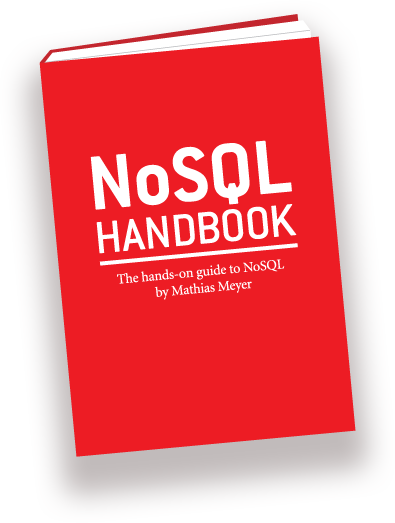

!SLIDE 

# A Tale Of Databases #

### Mathias Meyer, [@roidrage](http://twitter.com/roidrage)

!SLIDE center

!SLIDE

# Databases!

!SLIDE

# Disclaimer

!SLIDE

# What's Wrong With MySQL?

!SLIDE

# Nothing!

!SLIDE

## It just isn't always a great fit.

!SLIDE

### People don't choose
### a database based on facts,
### but because they like one
### more than the other.

!SLIDE center zoom-1000

### I was elected to lead, not to read.

!SLIDE center zoom-800

!SLIDE

## Five "Unthinkable" Options

!SLIDE five-options center

 

