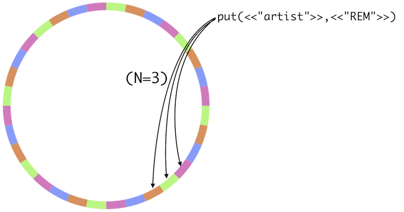

!SLIDE center riak

!SLIDE bullets incremental

# Riak #

* Availability
* Scalability
* [Amazon Dynamo](http://www.allthingsdistributed.com/2007/10/amazons_dynamo.html)

!SLIDE bullets incremental

# Riak #

* Key-Value Store
* Content-Agnostic

!SLIDE smaller

# Read

    $ curl localhost:8098/riak/confs/techtalksto

!SLIDE smaller

# Write

    $ curl -X PUT localhost:8098/riak/confs/techtalksto \
      -d '{type:"conference"}' \
      -H "Content-Type: application/json"

!SLIDE bullets incremental

# Availability #

* No Special Nodes

!SLIDE center

# Replication #

!SLIDE bullets incremental

# Replication

* N Replicas Stored
* Quorum Tuneable On Read/Write
!SLIDE bullets incremental

!SLIDE center

!SLIDE bullets incremental

# Scalability #

* Add/Remove Nodes
* Conflict Resolution

