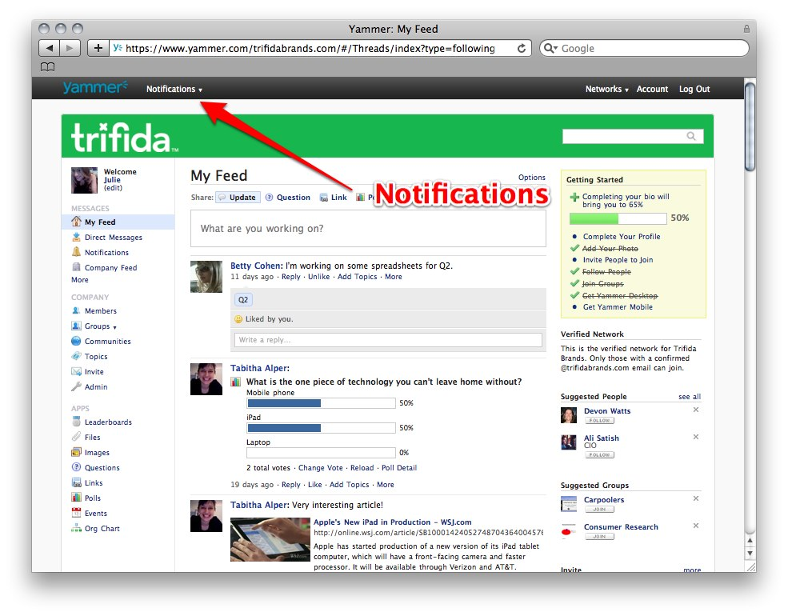
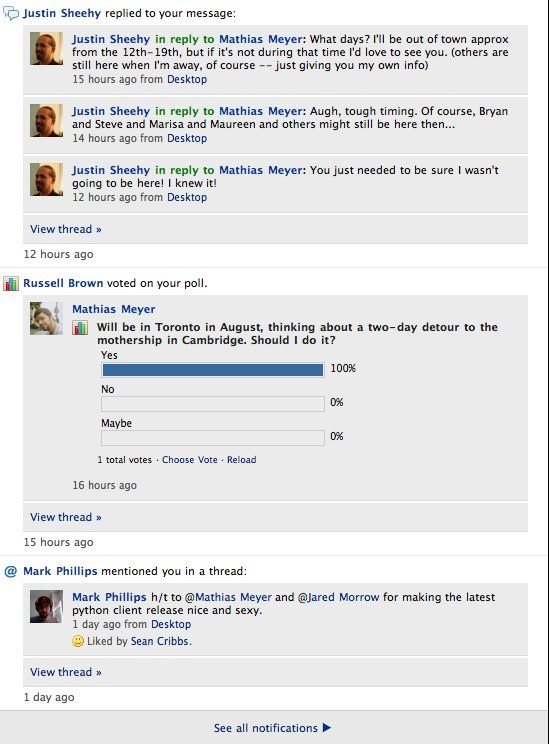

!SLIDE center

# Yammer #

!SLIDE center

# Notifications #

!SLIDE center

!SLIDE bullets incremental

# Problems #

* Time-Ordered
* Exponential Growth
* Concurrent Updates
* Low Latency
* Availability

!SLIDE smaller

# Data Model #

    {
      id: 41626118990497,
      timestamp: 1300845012,
      category: "likes-message",
      properties: {
        liker_id: 97238,
        thread_id: 2663589,
        message_id: 2664571
      }
    }

!SLIDE smallest

## List of Items per User ##

    [{
      id: 41626118990497,
      timestamp: 1300845012,
      category: "likes-message",
      ...
    },
    {
      id: 41626118990496,
      timestamp: 1300844012,
      category: "comment",
      ...
    },
    {
      id: 41626118990495,
      timestamp: 1300843012,
      category: "likes-message",
      ...
    }]

!SLIDE bullets incremental

# Data Model #

* One Key Per User
* Always Access Full Feed

!SLIDE bullets incremental

# Data Model #

* Pointer For Every Feed
* Last Read Item
* For Mobile, Web, Email

!SLIDE bullets incremental

# Updates #

* Add New Item
* Sort List 
* Filter Duplicates
* Purge Old Entries

!SLIDE bullets incremental

# Concurrent Updates #

* Creates Siblings

!SLIDE end-database

# `</riak>`
