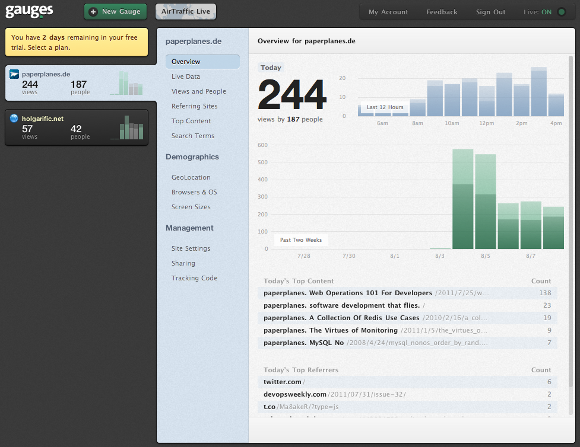
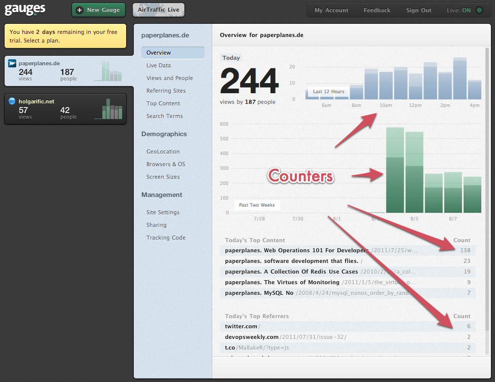

!SLIDE mongodb center

!SLIDE

## The MySQL of NoSQL ##

!SLIDE bullets incremental

* Document Database
* "Schema-less"
* Rich Query-Language

!SLIDE smaller

# BSON

    @@@ javascript
    var techtalksto = {
      "_id": ObjectId(),
      "name": "TechTalksTO",
      "location": "Toronto",
      "tags": ["technology", "nosql", "infrastructure"],
      "date": new Date()
    }

!SLIDE bullets incremental

# Collections

* ~= Tables
* Documents Of Similar Structure

!SLIDE smaller

# Saving Data #

    @@@ javascript
    db.conferences.save(techtalksto)

!SLIDE smaller

# Finding Data #

    @@@ javascript
    db.conferences.find({tags: 'nosql'})

!SLIDE smaller

# Finding Data

    @@@ javascript
    db.conferences.find({tags: 'nosql', location: 'Toronto'})

!SLIDE smaller

# Atomic Updates #

    @@@ javascript
    db.conferences.update(
      {tags: 'nosql'},
      {$inc: {attendees: 110}}
    )

!SLIDE smaller

# Atomic Updates #

    @@@ javascript
    db.conferences.update(
      {tags: 'nosql'},
      {$push: {tags: 'performance'}}
    )

!SLIDE bullets incremental

# [Gaug.es](http://gaug.es) #

* Visitor Tracking
* (Almost) Real Time

!SLIDE center

!SLIDE center

!SLIDE smaller

# Data Model #

    @@@ javascript
    {
      "_id": "paperplanes.de:20110811",
      "/2011/7/25/web_operations_101_for_developers.html": 138,
      "/2010/2/16/a_collection_of_redis_use_cases.html": 19
      "/2011/1/5/the_virtues_of_monitoring.html": 9
    }

!SLIDE smallish

    @@@ javascript
    stats = db.getCollection("paperplanes.de:201108")
    stats.update(
      {"_id": "paperplanes.de:20110811"},
      {$inc: {"/2011/7/25/web_operations_101_for_developers.html", 1}}
    )

!SLIDE bullets

# Added Benefits

* Data Partitioning
* Hot Data In Memory

!SLIDE bullets incremental

# Fun Facts

* Storage: mmap
* Everything Happens In Memory

!SLIDE bullets

# Other Uses

* Exception Tracking
* Short-Term Event Logging
* Queryable Cache
* Archive Unstructured Data

!SLIDE end-database

# `</mongodb>`
