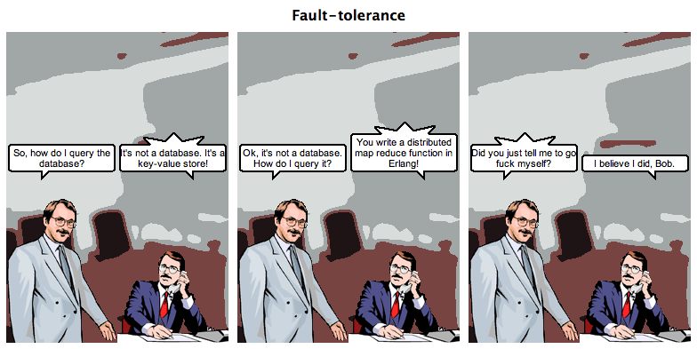
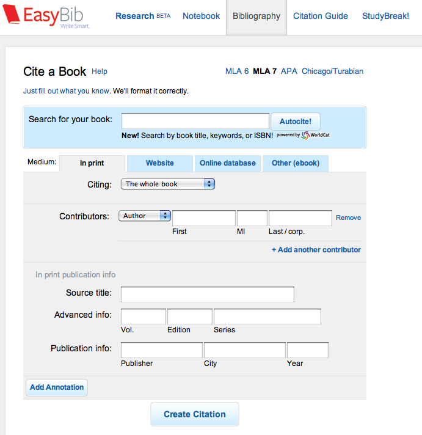
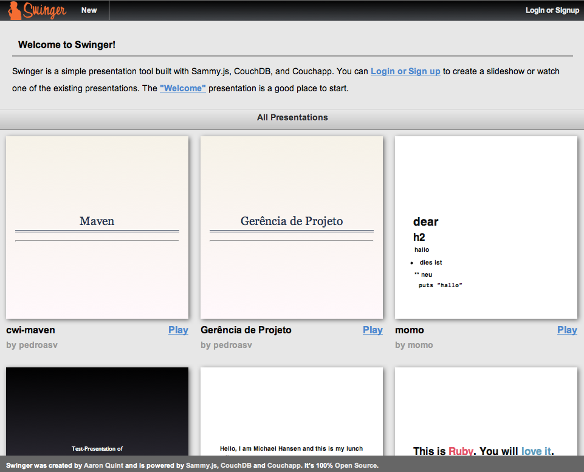

!SLIDE couchdb center

!SLIDE

## CouchDB is made off the web.

James Kaplan-Moss

!SLIDE bullets incremental

# CouchDB #

* HTTP
* REST
* JSON
* JavaScript

!SLIDE bullets incremental

* Document Database
* Queries With JavaScript

!SLIDE smaller

# Documents

    @@@ javascript
    {
      "_id": "0a34bfe",
      "_rev": "1-6f773089b853fd5f7867562b179a854a",
      "title": "A Tale Of Databases",
      "type": "presentation"
      "tags": ["couchdb", "riak", "redis", "mongodb"]
      "published_at": "2011/08/13 11:00:00 -0500"
    }

!SLIDE smallish

# Write

    $ curl -X PUT localhost:5984/conferences/0a34bfe \
      -d "..."

!SLIDE smallish

# Get

    $ curl localhost:5984/conferences/0a34bfe
    {...}

!SLIDE center zoom-1000

# How do I query my data?

!SLIDE

# MapReduce

    @@@ javascript
    function(doc) {
      for (var tag in doc.tags) {
        emit(tag, 1);
      }
    }

!SLIDE smaller

# Design Documents

    @@@ javascript
    {
      "_id": "_design/conferences"
      "views": {
        "by_tag": {
          "map": "function(doc) {..}",
          "reduce": "_sum"
        }
      }
    }

!SLIDE smallish

# Query Views

    $ curl localhost:5984/conferences/_design/conferences/_view/by_tag?key="nosql"

    {"rows":[
    {"key":null,"value":1}
    ]}

!SLIDE smallest

# Query Views

    $ curl localhost:5984/conferences/_design/conferences/_view/by_tag?\
           key="nosql"&include_docs=true&reduce=false

    {"total_rows":1,"rows":[
    {"key":"0a34bfe","key":"nosql","value":1,"doc":{...}}
    ]}

!SLIDE bullets incremental

# Views

* Keys Can Be Anything
* Range Queries
* Mind-Bending

!SLIDE bullets incremental

# [Easybib](http://easybib.com)

* Collect Citations
* Generate Bibliographies

!SLIDE center

!SLIDE bullets incremental

# Data Model

* 58 Different Forms
* Varying Structure
* Ideal For Documents

!SLIDE bullets incremental

* Migrated From MySQL
* Simple Views
* By User, By Project/User
* Using BigCouch/Cloudant
* 370 Million Documents

!SLIDE bullets incremental

# Little Details

* B-Tree+ For Storage
* All Reads Go To Disk
* Append-Only
* Replication

!SLIDE bullets incremental

# CouchApps

* Validations
* Lists
* Shows
* Authentication

!SLIDE center

!SLIDE end-database

# `</couchdb>`
