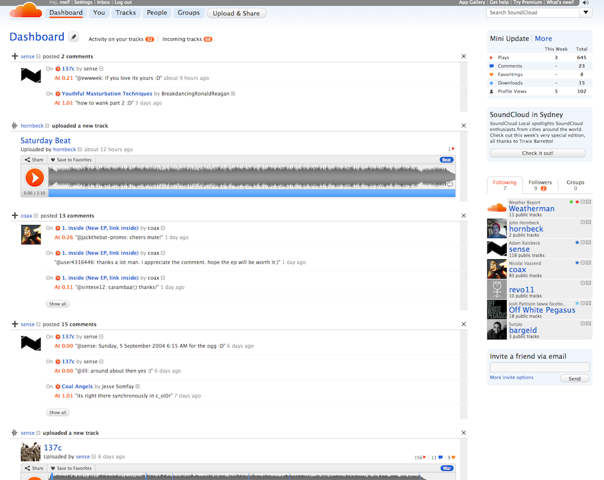

!SLIDE center

!SLIDE bullets incremental

# Requirements #

* Fast Writes
* Efficient Range Access

!SLIDE bullets incremental

# Data Model

* Feed Per User
* Ordered By Time
* Access By Time

!SLIDE bullets incremental

# Data Model #

    @@@ ruby
    Events["mathias"] = {
      "2011/27/06 12:15:00 +01:00" => {
        "type" => "comment",
        "owner_id" => 12345,
        "event_id" => 45678
      }
    }

#### (Example)

!SLIDE bullets incremental

# Fun Facts

* 3+ TB Data
* 1400 Writes/Second
* 6-12 Servers
* Problem: Garbage Collection

!SLIDE end-database

# `</cassandra>`
